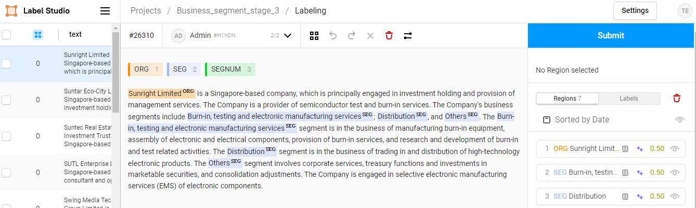
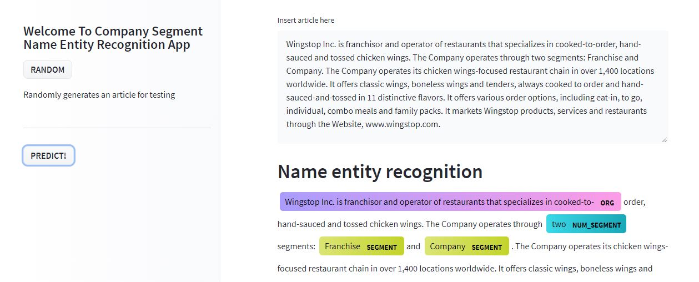
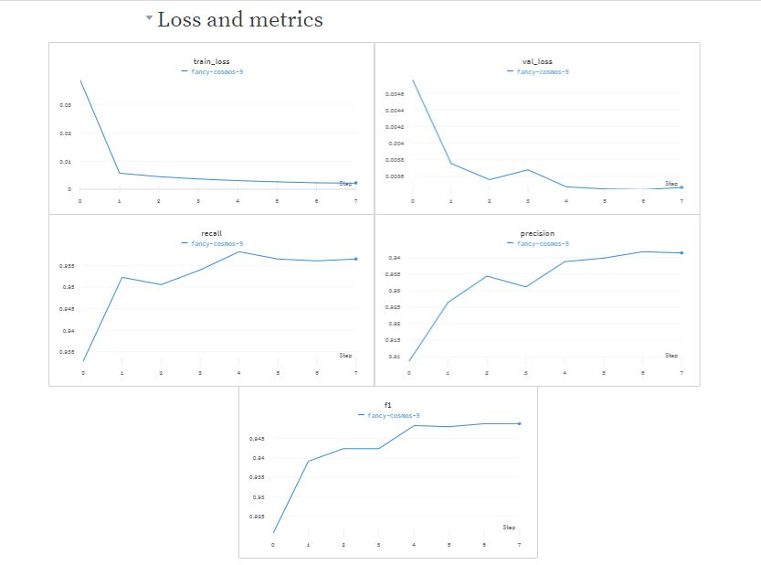

## Company Segment NER
The problem statement is how do we identify a company business segment. Like many other project, I am not given any data so I have to find my own data and train on them. The solution I came up with is to scrap around 6.8k reuters articles and label them in batches (1k each time) and use the model the predict on the rest of the dataset. In total I have labeled 4k data.

## labeling
I have decided to use labelstudio for my annotation task. It works pretty well but since I am using the free version, I am unable to use the active learning functionality

 

## Try it out!
Hit on random buttone to generate a random news article and hit predict to generate the predictions
https://huggingface.co/spaces/wolfrage89/company_segments_ner

 

## Training Script
Colab link: https://colab.research.google.com/drive/1DRa_STXCzxC8yZnyH4fV0i192b4-ewfO?usp=sharing
I have created the training script from scratch. I believe that will be something you can reference on for future NER task that you may have. It includes
1. Weights and biases logging
2. seqeval metrics
3. FP16 training
4. cosine annealing without reset learning rate scheduler

## Summary of the training
wandb report link: https://wandb.ai/zuozhe/company_segment_ner/reports/Company-Segment-NER--VmlldzoxNDk4NTYz?accessToken=zpo4zi9jxdyrmq6mn21omv8hprcxilj0h9fjqboacuv0e7dqacbwlwu32jh27k79

 

